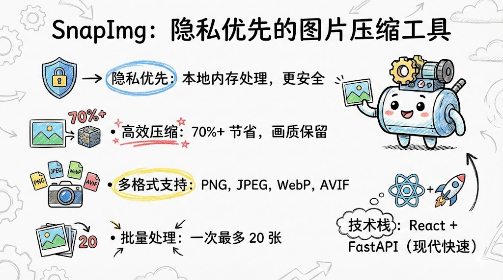
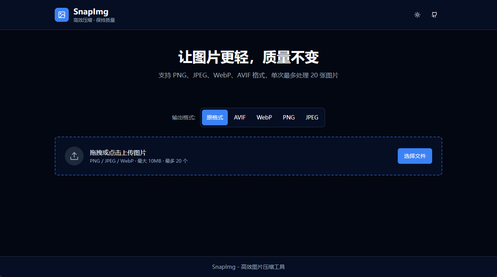
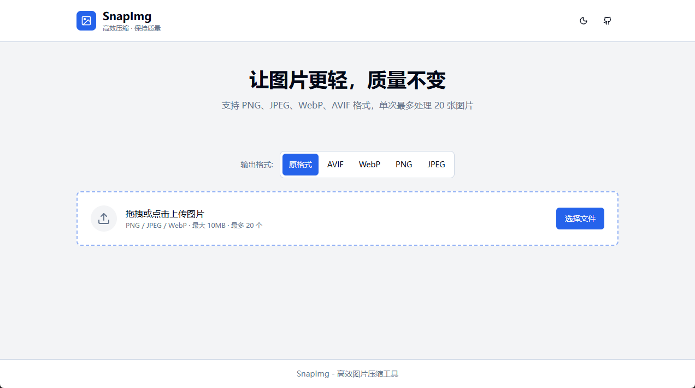

# SnapImg


English | [中文](README.md)

<p align="center">
  <a href="https://img.biekanle.com/" target="_blank">
    
  </a>
</p>

---

A fast, privacy-focused online image compression tool. Supports PNG, JPEG, WebP, AVIF formats with high compression ratio while maintaining quality.

## Features

- **Multi-format Support** - Input/output PNG, JPEG, WebP, AVIF formats
- **High Compression** - PNG uses pngquant/imagequant algorithm, 70%+ compression ratio
- **Quality Preserved** - Smart compression algorithm maintains image quality
- **Local Processing** - Images processed in memory, never saved to disk
- **Batch Processing** - Process up to 20 images at once
- **Visual Comparison** - Slide to compare before/after compression
- **Dark Mode** - Light/dark theme support

## Screenshots






## Tech Stack

**Frontend:**
- React 19 + TypeScript
- Tailwind CSS + Shadcn UI
- Vite

**Backend:**
- FastAPI + Python
- Pillow + imagequant + pngquant
- In-memory processing, no database

## Quick Start

### Docker (Recommended)

```bash
# Build image
docker build -t snapimg .

# Run container
docker run -d -p 80:80 --name snapimg snapimg
```

Visit http://localhost to use.

### Local Development

**Frontend:**

```bash
# Install dependencies
npm install

# Start dev server
npm run dev
```

**Backend:**

```bash
cd serve

# Create virtual environment
python -m venv venv
source venv/bin/activate  # Windows: venv\Scripts\activate

# Install dependencies
pip install -r requirements.txt

# Start server
python main.py
```

## Project Structure

```
snapimg/
├── src/                    # Frontend source
│   ├── components/         # React components
│   │   ├── ui/            # Shadcn UI components
│   │   ├── UploadZone.tsx
│   │   └── ImageCompare.tsx
│   ├── lib/               # Utilities
│   ├── App.tsx
│   └── main.tsx
├── serve/                  # Backend service
│   ├── app/
│   │   ├── api/           # API routes
│   │   ├── core/          # Core compression logic
│   │   └── models/        # Data models
│   └── requirements.txt
├── Dockerfile             # Docker build file
└── docker-compose.yml
```

## API

### POST /api/compress/single

Compress a single image.

**Request:** `multipart/form-data`
- `file`: Image file
- `format`: Output format (original/png/jpeg/webp/avif)

**Response:**
```json
{
  "filename": "image.png",
  "original_size": 1024000,
  "compressed_size": 307200,
  "compression_ratio": 70.0,
  "format": "png",
  "data": "data:image/png;base64,...",
  "success": true
}
```

## Contributing

Contributions are welcome! Please see [CONTRIBUTING.md](CONTRIBUTING.md) for details.

## License

[MIT License](LICENSE)

## Star History

[](https://www.star-history.com/#Moresl/snapimg&type=date)
